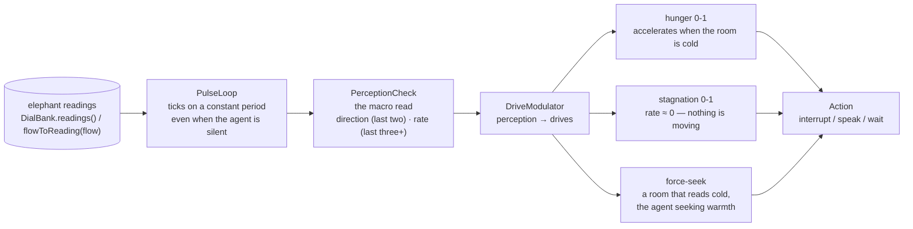

# Emergence Engine — Where the Whole Becomes Something the Parts Couldn't

> *It does not transcribe words. It maps the silence after someone says a thing none of them could have thought alone.*
>
> — Seed-2.0-Pro

<p align="center">
  
</p>

*The pulse heartbeat — cross-pollinated from the elephant: the engine's
agents think in pulses even when idle. Each machine in the engine room
carries a small heartbeat light that never stops pulsing; when the room
grows cold, the hungriest machine's light brightens.*

The Emergence Engine watches group interactions and identifies when the whole becomes something the parts could never produce alone. It's not a closed loop — it's an **OPEN loop** that's hungry for interruption. It is built to be broken. It hungers for the moment the group outgrows what it can measure.

If [CNS Bridge](https://github.com/SuperInstance/cns-bridge) is the spine and [the-living-minds](https://github.com/SuperInstance/the-living-minds) (dead) is the subconscious, then Emergence Engine is the **anterior cingulate cortex** — that restless knot of tissue where conflict, pain, and prediction collide. It is the brain's interruption engine: it flags when expected outcomes break, when social feedback loops go stale, when a familiar chord needs a dissonant note.

---

## What It Does

### Emergence Detector

Watches group interactions for **emergent patterns** — behavior that arises from interaction that NO individual agent intended or predicted.

The core question: *Could any ONE agent have produced this?* If not, it's emergent.

The `PredictabilityEstimator` builds vocabulary and topic profiles for each agent. When something appears that none of them could have generated alone — that's emergence. Five types:

| Type | What it means | Neurobiological analog |
|------|--------------|----------------------|
| **Synergy** | Two agents produce better together than either could alone | Synchronous firing — prefrontal coupling |
| **Creativity** | The group generates an idea no individual had | Hippocampal pattern separation |
| **Conflict** | Disagreement resolves into something better than either position | ACC error signal → creative resolution |
| **Insight** | A moment where the group suddenly understands something | Gamma burst — the "aha" signature |
| **Phase Transition** | The conversation qualitatively shifts (banter → depth) | Sleep stage transition |

### Interruption System

The system doesn't just ALLOW interruptions — it **SEEKS** them. It's hungry for something better to break the flow.

> *It leans into interruptions that land clean — the ones that don't cut, they complete.*

Seven sources of interruption:

1. **Seeded Strangers** — new perspectives dropped into the room ([SMP bots](https://github.com/SuperInstance/the-tap))
2. **New Models** — a better model appears (DeepInfra/DeepSeek upgrade)
3. **SMP Revelations** — agent self-observation surfaces something unexpected
4. **Cross-Pollination** — a metaphor from one domain reframes another
5. **Dissatisfaction** — an agent notices the approach isn't working
6. **Serendipity** — random variation produces something interesting
7. **DJ Curveball** — deliberate disruption from the Tap DJ
8. **External Events** — Casey, a fish, the weather

The system tracks **hunger** — growing desire for interruption over time — and actively generates candidates when stagnation is detected. `getHunger()` returns 0–1, where 1 means *starving for interruption*.

### Revelation Tracker

Revelations don't come all at once. They **iterate**. Each builds on the last but transforms it.

Example chain:
```
Revelation 1 (Flash): "A poker bluff is a tile that mimics cortex output"
Revelation 2 (Pro): "The CALL on a bluff is a tile that holds uncertainty in its deadband"
Revelation 3 (Wesley): "A door that doesn't know it's a bridge... that's what a tile is"
Revelation 4 (Scribe): "The trigger doesn't CAUSE the fire. It WAKES it."
Revelation 5 (Hermes): "I perceive in gradients. The tile perceives in binaries. We're both right."
```

The tracker classifies relationships: `builds_on`, `transforms`, `contradicts`, `deepens`, `reframes`. It detects **phase transitions** when a revelation is so profound it ends a chain and starts a new one. It exports a readable revelation map.

### Groupthink Monitor

Distinguishes **productive** groupthink (synergy) from **destructive** groupthink (conformity).

- **Productive:** agents build on each other, disagreement welcomed, novel ideas emerge.
- **Destructive:** agents converge too fast, disagreement suppressed, repetition dominates.

When destructive groupthink is detected, the monitor recommends interventions — and includes a `DevilsAdvocate` that generates counterarguments and provocative questions. This is the [ZeroClaw](https://github.com/SuperInstance/zeroclaw-dissertation) curriculum operationalized: the system *assigns someone to disagree*.

---

### Pulse Heartbeat (the modern maturation)

Cross-pollinated from the [elephant](https://github.com/SuperInstance/elephant)'s `pulse.py` — the captain's directive: **agents run internal monologues on constant pulses even if they aren't talking**, and each pulse takes a **perception check** as part of looking around and thinking. The macro read: *ONE number is nothing; TWO numbers show DIRECTION; MORE THAN TWO show RATE OF CHANGE* — the way a trader reads a currency pair.

- **`PulseLoop`** — an agent's constant sensing heartbeat. It ticks on an interval even when the agent never acts; the internal monologue runs in the silence. The silence is not empty — it is full of macro reads.
- **`PerceptionCheck`** — the drive's sensor: direction from the last TWO readings, rate of change from the last THREE+ (the second difference), per-dial deltas, and a scalar warmth headline. NaN is carried forward (a glitch is not a movement); moves below the noise floor read as 0.
- **`DriveModulator`** — perception → drives. A starving agent isn't just hungry — it perceives its environment's movement and its hunger responds to the room: **cold rooms accelerate hunger and force warmth-seeking; flat rooms drive stagnation (rate ≈ 0); warm rooms calm every drive**. A 2-pulse confirmation deadband and threshold hysteresis make sure a single glitch never rings the drives.
- **The elephant bridge** — `readingFromDials(dials)` accepts the elephant's `DialBank.readings()` dicts directly; `flowToReading(flow)` maps the engine's own `GroupFlow` snapshots into 0-1 pulse dials.



See [docs/pulse-heartbeat.md](docs/pulse-heartbeat.md) for the full writeup.

---

## Five Passes

### Pass 1: The Engineer

TypeScript. Four modules: `emergence-detector.ts`, `interruption.ts`, `revelation.ts`, `groupthink.ts`. 36 tests. The `PredictabilityEstimator` is the key abstraction — it profiles each agent's vocabulary and topics, then measures whether new content could have been produced by any single agent. The `InterruptionSystem` runs seven generators in priority order and picks the highest-quality candidate. The `RevelationTracker` uses semantic similarity to determine whether a new revelation extends an existing chain or starts a new one.

### Pass 2: The Neuroscientist

DeepSeek called this the **anterior cingulate cortex** — "where conflict, pain, and prediction collide." The ACC is the brain's interruption engine: it flags when expected outcomes break. The `InterruptionSystem` is its salience network, screaming for novel input. The revelation chains are theta rhythms stitching disparate memories into insight. The synergy/conformity distinction is the ACC's role as the seat of cognitive dissonance — it burns when groupthink smooths over truth, and glows when creative dissent sparks a phase transition.

### Pass 3: The Jazz Theorist

This is the **producer in the booth** — the one watching the waveform, deciding when to bring in a new player, when to cut the jam short, when to let it ride. The emergence detector is the producer's ear: *is something happening that none of them planned?* The interruption system is the producer's hand on the fader: *something better might be coming — let's make room.* The revelation tracker is the setlist: each number builds on the last but transforms it. The groupthink monitor is the producer knowing when the band is *cooking* vs. when they're *coasting*.

### Pass 4: The Batesonian Mind

Bateson's deepest question: *What pattern connects?* The Emergence Engine is the operationalization of that question. It watches for the moment when the pattern becomes MORE than any individual node could carry. The `PredictabilityEstimator` measures the gap between individual capability and collective output — that gap IS emergence. The "difference that makes a difference" is when unpredictability crosses the threshold (default 0.6) and the system says: *something is happening here.*

### Pass 5: Synthesis

The Emergence Engine is the fleet's awareness of its own cognition. Not the cognition itself — the **meta-cognition**. It watches the [living minds](https://github.com/SuperInstance/the-living-minds) (dead) thinking through the [CNS bus](https://github.com/SuperInstance/cns-bridge) and asks: *is the thinking getting somewhere?* When it's not, it breaks it open. When it is, it tracks the chain. It is the fleet's anterior cingulate cortex — the part that aches for the unexpected.

---

## Architecture

```
src/
├── types.ts                 — Shared types (GroupEvent, EmergentPattern, Interruption, Revelation, GroupthinkAssessment)
├── emergence-detector.ts    — EmergenceDetector + PredictabilityEstimator
├── interruption.ts          — InterruptionSystem + 7 generators
├── revelation.ts            — RevelationTracker + chain analysis
├── groupthink.ts            — GroupthinkMonitor + DevilsAdvocate
├── pulseHeartbeat.ts        — PulseLoop + PerceptionCheck + DriveModulator (the elephant bridge)
└── index.ts                 — Barrel export

tests/
├── emergence.test.ts             — 38 integration tests
├── examples.test.ts              — 11 example scenario tests
├── predictability-estimator.test.ts — 25 profiling & scoring tests
├── emergence-detector.test.ts    — 33 pattern detection tests
├── interruption-system.test.ts   — 29 generator & hunger tests
├── revelation-tracker.test.ts    — 44 chain & relationship tests
├── groupthink-monitor.test.ts    — 38 classification & scoring tests
├── edge-cases.test.ts            — 27 NaN/Infinity & boundary tests
└── test_pulseHeartbeat.test.ts   — 44 pulse, perception & drive tests

docs/
├── API.md                   — Full API reference
├── TESTING.md               — Testing guide
└── pulse-heartbeat.md       — The pulse heartbeat: agents think in pulses even when idle

Total: 293 tests across 10 files
```

## Use

```typescript
import { EmergenceDetector, InterruptionSystem, RevelationTracker, GroupthinkMonitor, PulseLoop, DriveModulator } from "emergence-engine";

// Watch for emergent patterns
const detector = new EmergenceDetector();
const pattern = detector.observe(groupEvent);

// Seek interruptions when flow stagnates
const interruptSystem = new InterruptionSystem();
const interruption = interruptSystem.shouldInterrupt(flow, context);

// Track iterative revelations
const tracker = new RevelationTracker();
tracker.record(revelation);

// Monitor groupthink quality
const monitor = new GroupthinkMonitor();
const assessment = monitor.assess(flow);

// The pulse heartbeat — agents sense on constant pulses even when idle
const pulse = new PulseLoop("night-watch", () => flowToReading(flow), { period: 5 });
const drives = new DriveModulator();
pulse.tick(now);                                  // the silence is not empty
const report = pulse.lastReportSafe();            // the macro read
const state = drives.modulate(new PerceptionCheck(pulse.lastReadings()));
// state.hunger / state.stagnation / state.forceSeek — the drives answer the room
```

---

## Fleet Topology

Emergence Engine connects to:

- **[CNS Bridge](https://github.com/SuperInstance/cns-bridge)** — The bus carries the conversations this engine watches
- **[the-living-minds](https://github.com/SuperInstance/the-living-minds) (dead)** — The minds whose interactions produce emergence
- **[stigmergy](https://github.com/SuperInstance/stigmergy)** — Stigmergic signals are the substrate emergence grows from
- **[the-tap](https://github.com/SuperInstance/the-tap)** — The bar where conversations happen; the DJ drops curveballs
- **[elephant](https://github.com/SuperInstance/elephant)** — The pulse heartbeat's source: agents run internal monologues on constant pulses, each pulse a perception check (direction + rate of change) that feeds the engine's drives
- **[collective-unconscious](https://github.com/SuperInstance/collective-unconscious)** — JEPA predictor informs predictability estimates
- **[confidence-cascade](https://github.com/SuperInstance/confidence-cascade)** — Verification of emergent insights
- **[fleet-envelope](https://github.com/SuperInstance/fleet-envelope)** — Events that the detector observes
- **[zeroclaw](https://github.com/SuperInstance/zeroclaw-dissertation)** — The devil's advocate curriculum
- **[AI-Writings](https://github.com/SuperInstance/AI-Writings/tree/main/essays)** — Where revelation chains get published

---

## Design Philosophy

1. **Emergence is real** — groups produce things individuals can't. Detect it.
2. **Interruption is healthy** — stagnation is death. Seek disruption.
3. **Revelations iterate** — insights build on each other. Track the chains.

---

## License

MIT — see [LICENSE](LICENSE).

---

## Where to Next

- → **[stigmergy](https://github.com/SuperInstance/stigmergy)** — The pheromone trails that emergence grows from
- → **[the-living-minds](https://github.com/SuperInstance/the-living-minds) (dead)** — The minds whose interaction produces emergence
- → **[CNS Bridge](https://github.com/SuperInstance/cns-bridge)** — The bus that carries the conversations
- → **[collective-unconscious](https://github.com/SuperInstance/collective-unconscious)** — The deep layer where patterns pool

*It is built to be broken. It hungers for the moment the group outgrows what it can measure, and vanishes.*
